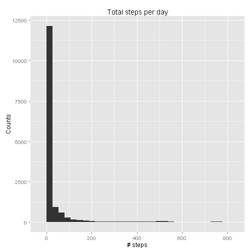
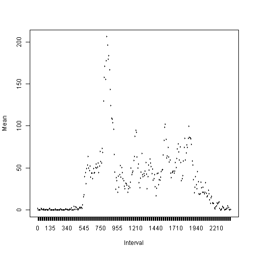
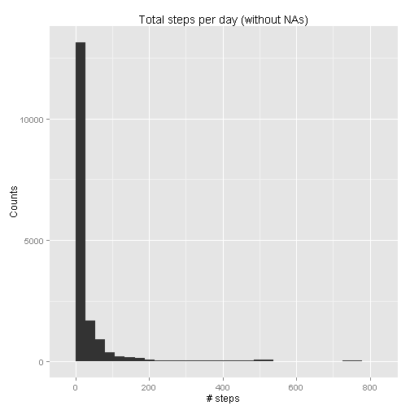
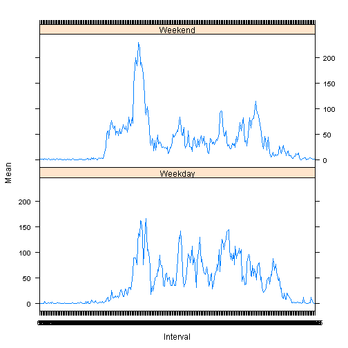

# Reproducible Research - Assignment 1

set working directory and read file

```r
setwd("C:\\Coursera\\DataScience\\5_ReproducibleResearch\\Project1")
activ = read.csv("activity.csv")
```

calculate mean and median

```r
steps.mean = mean(activ$steps, na.rm = TRUE)
steps.median = median(activ$steps, na.rm = TRUE)
```

Create histogram for total steps per day

```r
library(ggplot2)
qplot(steps, data=activ, geom="histogram", main="Total steps per day", xlab="# steps", 
   ylab="Counts")
```

```
## stat_bin: binwidth defaulted to range/30. Use 'binwidth = x' to adjust this.
```

 

Calculate interval means. First create intervals as factors

```r
facint = factor(activ$interval)
interval.ave <- aggregate(activ$steps, by = list(facint), FUN = mean, na.rm=TRUE)
names(interval.ave) = c("Interval", "Mean")
```

Time series plot

```r
plot(interval.ave$Interval, interval.ave$Mean, xlab= "Interval", ylab= "Mean", type = "l", col = "red") 
```

 

interval with maximum number of steps across all the days

```r
interval.ave[interval.ave$Mean == max(interval.ave$Mean),]
```

```
##     Interval     Mean
## 104      835 206.1698
```

Total number of missing values

```r
sum(is.na(activ$steps))
```

```
## [1] 2304
```

Fill in NAs in new activfull dataframe with the mean for the interval 

```r
activfull = activ
for(i in seq_along(activfull$steps)) if(is.na(activfull$steps[i])) activfull$steps[i] <- interval.ave$Mean[interval.ave$Interval == activfull$interval[i]]
sum(is.na(activfull$steps))
```

```
## [1] 0
```

histogram of new dataset

```r
qplot(steps, data=activfull, geom="histogram", main="Total steps per day (without NAs)", xlab="# steps", 
   ylab="Counts")
```

```
## stat_bin: binwidth defaulted to range/30. Use 'binwidth = x' to adjust this.
```

 

mean and median in new dataset

```r
stepsfull.mean = mean(activfull$steps, na.rm = TRUE)
stepsfull.median = median(activfull$steps, na.rm = TRUE)
```
create new dataset

```r
activfull2 = activfull
```

get day names

```r
activfull2$day = weekdays(as.Date(activfull2$date))
activfull2$day = as.factor(activfull2$day)
activfull2$daytype[activfull2$day %in% c("Monday", "Tuesday", "Wednesday", "Thursday", "Friday")] = c("W")
activfull2$daytype[activfull2$day %in% c("Saturday", "Sunday")] = "E" 
activfull2$daytype = as.factor(activfull2$daytype)
```

Calculate interval means. First create intervals as factors

```r
interval2.ave <- aggregate(activfull2$steps, by = list(facint, activfull2$daytype), FUN = mean, na.rm=TRUE)
names(interval2.ave) = c("Interval", "DayType", "Mean")
```

Create weekday and weekend factors

```r
interval2.ave$DayType = factor(interval2.ave$DayType, labels = c("Weekday", "Weekend"))
```

Plot weekend and weekdays 

```r
library(lattice)
xyplot(Mean ~ Interval | DayType, data = interval2.ave, type="l", layout = c(1, 2))
```

 


